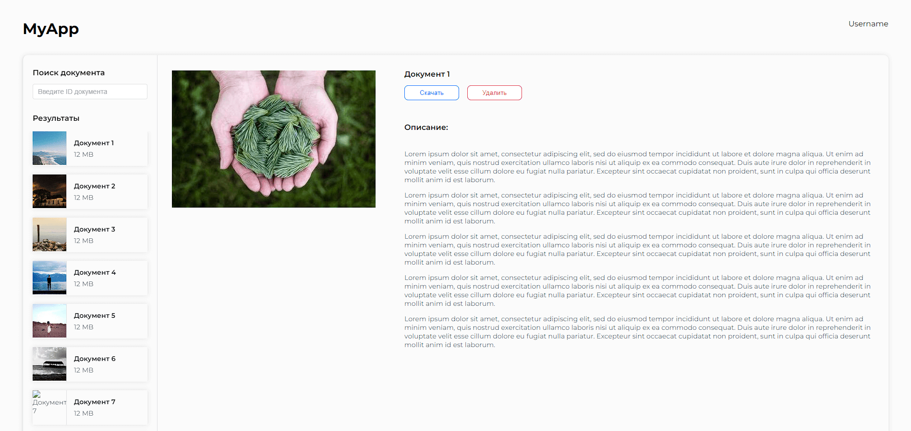
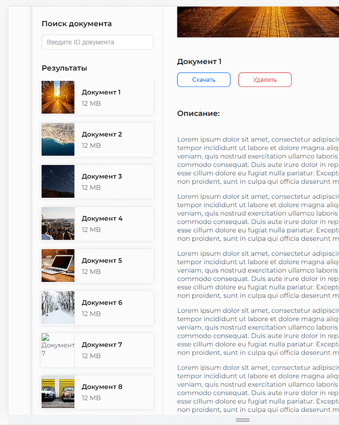
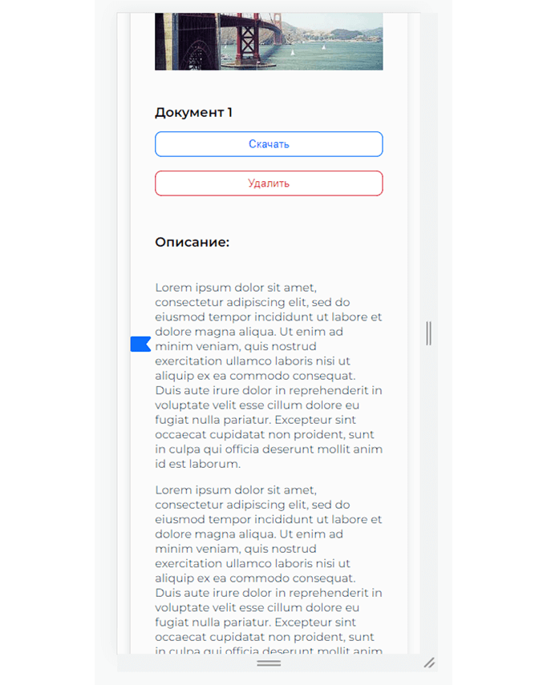
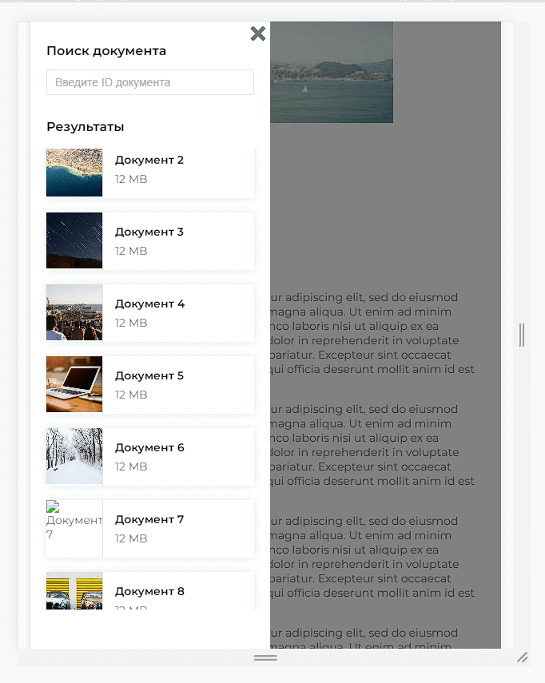

# vue-pdf
Демонстрационное приложение по загрузке PDF-файлов
#### <a href="http://5.53.125.150:8080">онлайн демонстрация</a>

<ul>
<li>Приложение на Vue3(composition api) + Vite</li>
<li>Авторизация и иные запросы реализованы при помощи Access(время жизни установлено в 1мин) и Refresh(время жизни установлено в 2мин) токенов</li>
<li>Сигнализирование пользователя через прелоадеры о процессе запроса</li>
<li>Поиск документов по названию</li>
<li>Вывод ошибок в alert для уведомления пользователя о возникших проблемах. Разделение ошибок на критические, блокирующие работу системы(например в случае истечения срока жизни Refresh токена) и стандартные</li>
<li>По клику на кнопку "скачать", формируется документ в формате pdf</li>
<li>Разумное использование типизации. Использование Typescript для описания типов переменных и аргументов функций</li>
</ul>

  

dashboard mobile

    
    
    

